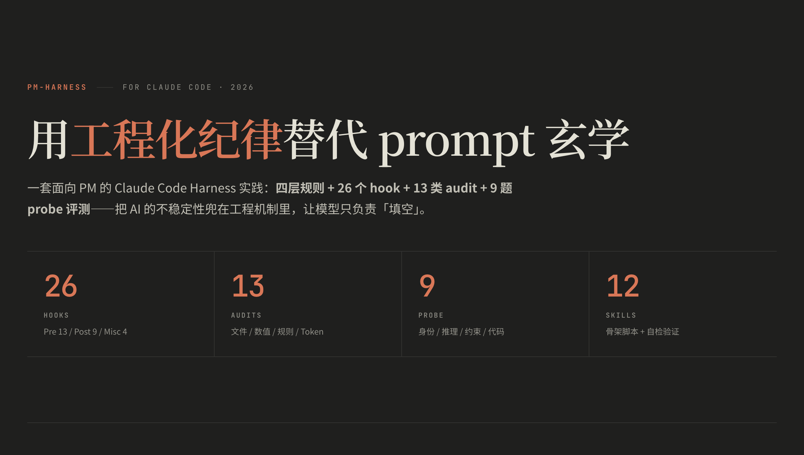
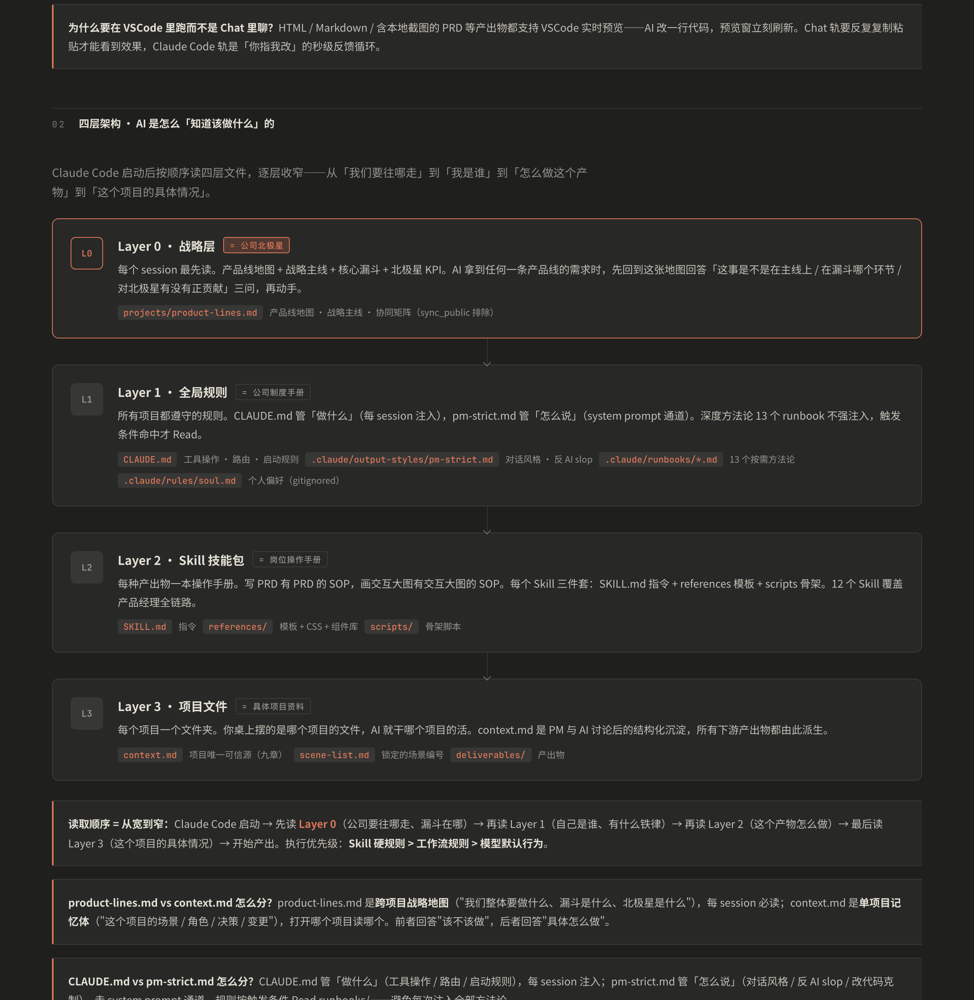
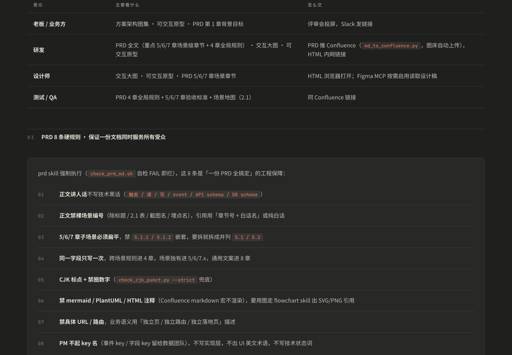
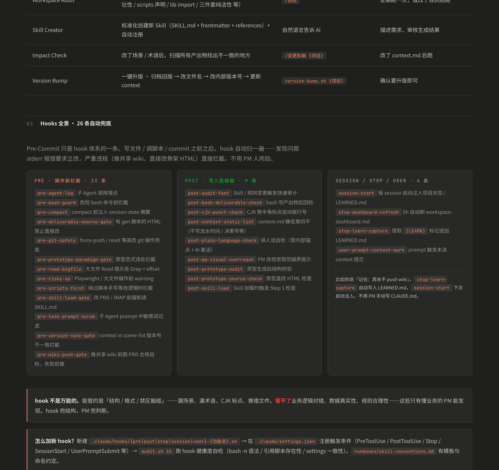

<div align="center">

# ATLAS

`THE AI-NATIVE PM WORKSPACE · PM-WS`

**中文** · [English](README-EN.md)

会议纪要 / MRD / 竞品截图 → 场景清单、交互大图、PRD。16 个 Skill 覆盖产品经理全链路。

[](LICENSE)
[](.claude/skills)
[](.claude/hooks)
[](.claude/skills/workspace-audit)
[]()
[]()
[](https://docs.anthropic.com/en/docs/claude-code)

</div>

---

## 痛点与解法

| 维度 | 原来 | 现在 |
|:--|:--|:--|
| 输入 | 会议纪要 / MRD / 竞品截图 / 口头需求 | 同左 |
| 过程 | PM 手动画原型、写 PRD、反复对齐 | AI 按 Skill 自动产出，PM 审核微调 |
| 耗时 | 3-5 天 | 10 分钟 − 2 小时 |
| 一致性 | 每次结果不同，术语混乱 | 编号锁定 + 术语全局一致 + 18 类 audit 拉通 |
| 下游 | PRD 扔给研发自己理解 | PRD md 作为唯一可信源 — 业务对象 / 状态机 / 5 段式 / 文案矩阵都在一份文档，研发 / 设计 / QA AI 各取所需 |
| 方法论沉淀 | 散落在个人习惯和文档里 | 战略层 + 工作流层 + 项目层三层落盘，可跨 session / 跨模型复用 |



> 16 Skill 覆盖产品经理全链路、旗舰模型讨论 → 中档模型产出节约 ~46% 成本。AI 干体力活（按模板批量生成、术语全局一致、跨文档校验），PM 干脑力活（取舍、向上管理、审业务真实性）。

---

## 快速体验 · 20 分钟跑完基金认申赎

虚构的私募基金认申赎项目，完整走完 baseline → scene-list → 交互大图 → PRD 四步，Sonnet 级中档模型实测 ~20 分钟：[`examples/private-fund-demo/`](examples/private-fund-demo/)。


> 上图是交互大图顶部 PART 0 · H5 投资人端（A-1 基金详情 + 认购下单 / A-2 协议签署 + 冷静期）。全部 5 Scene + 跨端数据流表见 [完整 HTML](examples/private-fund-demo/deliverables/imap-private-fund-v1.html)。

| 产出物 | 规模 |
|:--|:--|
| [prd-private-fund-baseline.md](examples/private-fund-demo/prd-private-fund-baseline.md) | living baseline / 5 个场景锁定 |
| [scene-list.md](examples/private-fund-demo/scene-list.md) | 2 View / 5 Scene / P0 × 5 |
| [交互大图 HTML](examples/private-fund-demo/deliverables/) | 单文件 / 9 手机 mockup + 1 Web 后台 + 跨端数据流表 |
| [PRD docx](examples/private-fund-demo/deliverables/) | 横版 8 章 / 20 表格 / 5 张 Scene 截图（demo 为早期 docx 形态；现行 PRD skill 已转 md） |

选私募基金是因为它的合规链条很典型（合格投资者 / 冷静期 / 大额赎回 / 净值披露），能完整展示"从模糊需求到 PRD 交付"全流程。生成脚本在 `examples/private-fund-demo/scripts/`，拷到自己项目改数据即可。

---

## 快速开始

> 👉 完整安装手册：**[SETUP.md](SETUP.md)**（CC Switch 配置 / MCP 适配 / Python 依赖逐项说明 / 项目目录范式 / 问题排查表）
> 下面是 6 步极简版，能跑就行。

```bash
# 1. Clone
git clone git@github.com:CaufieldZ/pm-workspace.git
cd pm-workspace

# 2. 装依赖（macOS / Linux / WSL / Git Bash）
python3 -m pip install -r requirements.txt
python3 -m playwright install chromium
node --version   # Node 18+；根目录无 npm 依赖，不需要 npm install

# Windows PowerShell：把 python3 换成 py -3 或 python

# 3. 激活防腐化 hook（pre-commit 跑 audit.sh 1,2,3,4,7,12,13,14,15,16,17,19,20,21）
git config core.hooksPath .githooks

# 4. 个性化（可选）
#    根目录 LEARNED.md 写沟通偏好 / 术语补丁（每 session 自动读，存在即生效）
#    或在 .claude/output-styles/ 下新建 style 文件做更结构化的风格控制

# 5. 打开项目
#    VSCode + Claude Code 扩展（推荐）
#    不建议 Cursor —— Agent 体系会与 Skill / Hook 冲突

# 6. 第一个项目
#    在 Claude Code 中输入：
#    > 新项目 my-first-project，需求是…
```

---

## 三层架构

整个系统由**战略 → 工作流 → 项目**三个层次构建，下层引用上层，上层不感知下层：



> 启动顺序从宽到窄——L0 战略 → L1 全局规则 → L2 Skill 包 → L3 项目文件。下图把 README 的"工作流层"按文件类型进一步拆为 L1 全局规则（CLAUDE.md + runbooks）+ L2 Skill 包（SKILL.md + references + scripts），更接近真实文件分布。

### Layer 1 · 战略层

`projects/product-lines.md` · **产品线地图**（projects 目录准入规则）。在战略决策 / 跨产品线协同 / 一键开项目识别归属时 Read（触发条件见 CLAUDE.md），让模型做单条产品线决策时仍能看到全局（漏斗 5 阶段 / 信任 4 维 / 北极星 KPI / 产品线协同矩阵 / 决策三问）。**`projects/` 整体被 sync_public.sh 排除**，不进 public sync —— 每家公司自己写一份。

### Layer 2 · 工作流层

产品经理方法论落盘，跨项目复用。注入策略分两档：

| 文件 | 加载方式 | 管什么 |
|:--|:--|:--|
| `CLAUDE.md` | 每 session 注入 | 工具操作 · 快捷路由 · 收到需求 PM-GATE 4 风险扫描 · 三条链路映射 · runbook 触发条件 |
| `.claude/runbooks/*.md` | 触发条件命中按需 Read | 18 个 runbook（方法论 / 产物规范 / 决策框架 / LNO / 项目管理 / 版本同步 / 讲人话铁律含对话风格 / HTML pipeline / Confluence 考古等） |
| `LEARNED.md` | 每 session 注入（可选） | 个人沟通偏好 + 纠错沉淀（根目录，存在即读，gitignored） |

### Layer 3 · 项目层

`projects/{产品线}/prd-{产品线}-baseline.md` + `scene-list.md` · **项目唯一可信源**。PM 与 AI 讨论需求后的结构化沉淀（living 当前态全量），所有下游产出物都由此派生。改一个术语、加一个场景，依赖链自动扫描波及范围。

**baseline + delta** 形态：baseline 是 living 当前态真相（无版本号，反映线上现状全量）；本轮迭代写 delta（`deliverables/{季度}/{版本}/`），上线后反向合并进 baseline 并补 changelog。核心约束：baseline 必须反映最新状态，delta changelog 按日期追加不改不删。

```
素材（会议纪要 / MRD / 竞品 / 口述）
        ↓ 与 AI 讨论提炼
   baseline（living 当前态）+ delta（本轮迭代）
        ↓ 进入产出物链路
   scene-list → imap → prototype → prd → cross-check
        ↓
   下游 AI Agent 直接使用
```

**两层优先级**（分清概念）：

- **路由优先级**（先走哪条路）：快捷路由（CLAUDE.md 快捷路由表）> Skill > runbook > 模型默认。
- **执行约束优先级**（同一条路里谁的话算数）：Skill 硬规则 / hook block > CLAUDE.md / runbook > 模型默认。

---

## Skill 流程

6 个 Pipeline 位 Skill 按依赖顺序执行（含收尾拉通的 cross-check），6 个独立 Skill + 1 个工具 Skill 随时调用，另有 3 个场景定制扩展示范「自建 Skill 怎么落地」。共 16 个。

```
1 scene-list ─→ 2.5 arch-diagrams* ─→ 3 interaction-map
                                              │
  ┌───────────────────────────────────────────┘
  ▼
4 prototype* ─→ 5 prd ─→ 8 cross-check

                                       * = optional
```

> PRD md 形态整合了原 behavior-spec / page-structure 的所有独有价值（业务对象词典 / 业务动作 5 段式 / 通用文案清单 / 信息层次矩阵），不再单独成 skill。

### Pipeline（6 个）

| # | Skill | 产出 | 格式 |
|:-|:-|:-|:-|
| 1 | scene-list | 需求拆解为场景，编号锁定全局引用（md + 可选 HTML 视觉版） | `.md` / `.html` |
| 2.5 | architecture-diagrams | 多系统 / 资金流转架构，多 Tab 文档 | `.html` |
| 3 | interaction-map | 多端 UI 流 + 跨端数据流，Mockup 级 | `.html` |
| 4 | prototype | 可点击高保真原型，数据驱动联动 | `.html` |
| 5 | prd | 12 章 md PRD，含业务对象 / 5 段式 / 文案矩阵 / 埋点 SLA，自动推 Confluence | `.md` |
| 8 | cross-check | 7 维自动对账（编号 / 术语 / 字段 / 状态 / 合规 / 埋点 / 假设） | 终端输出 |

### Standalone（6 个）

| Skill | 说明 |
|:-|:-|
| competitor-analysis | 竞品调研：情报采集（APP 截图 / Web 截图 / 公告抓取）+ 三角对比 + 可借鉴点提取 |
| data-report | 周报 / 月报 / 季报，神策 + 有数自动化 |
| flowchart | 流程图 / 泳道图 / 审批流，独立产出可嵌入其他文档 |
| mrd-review | MRD 评审：投票表 + 价值判断 + 市场窗口验证 |
| ppt | 方案 / SOP → HTML 多 Tab 文档 + 口播稿 |
| user-manual | 操作手册 / 帮助中心文章 / 营销宣发稿，面向用户的上线交付物 |

### 扩展（3 个 · 自建范例）

| Skill | 说明 |
|:-|:-|
| promo-kit | 功能 / 活动写成对外宣发内容（视频分镜 / 图文 4 宫格 / 短文案三选一或组合） |
| aihub-package | 企业 AI 平台出包流水线（脱敏 checklist → 预检 → 打包 → 验证），跨部门分发 Skill 的范例 |
| hx-cli | 内部项目管理 CLI 桥接（任务 / 需求 / 进度查询），「工具型 Skill 怎么包内部系统」的范例 |

### Tool（1 个）

| Skill | 说明 |
|:-|:-|
| workspace-audit | 全局诊断（Phase 1 脚本 18 类 + Phase 2 模型推理 4 类），含 Hooks 健康度与规范承诺一致性 |

---

## 下游 AI 使用

PRD md 一次定义、多处使用——业务对象 / 状态机 / 子场景区块表全部结构化锁定，下游 AI Agent 不必二次解读：



```
         ┌─→ 3.2 业务对象 + 3.3 状态机 ────────────→ 研发 AI       (Cursor · Copilot · Claude Code)
         │
PRD md ──┼─→ 5/6/7.x 子场景区块表 + 截图 ──────────→ 设计 / 前端 AI
         │
         └─→ 4 章全局规则 + 异常分支 + 9 章埋点 ──→ QA AI · 自动化测试
```

| PRD 章节 | 落位形态 | 使用方 | 价值 |
|:-|:-|:-|:-|
| 3.2 业务对象词典 / 3.3 枚举 + 状态机 | 字段表 + Mermaid | 研发 AI | 字段类型 / 生命周期 / 状态转移直接输出 SQL · 事件 · 接口 |
| 5/6/7.x 子场景「页面元素 & 规则」区块表（区块 / 数据来源 / 规则 / 文案 4 列）+ assets/ 截图 | 表格 + PNG | 设计 / 前端 AI | 模块 → 字段 → 规则 → 文案强绑定，可视化照表落实 |
| 4 章全局规则 / 5-7.x 异常分支 / 9 章埋点 | 规则段 + 埋点表 | QA AI · 自动化 | 业务规则 + 异常 + 埋点口径，测试用例直出 |

---

## 工程质量



### 硬性约束（代码层面拦截）

| 机制 | 说明 |
|:-|:-|
| 防腐化 hook | `.githooks/pre-commit` 每次 commit 跑 secret scan + staged 大文件/本地原料拦截；Skill / 规则 / `.claude/hooks/` 变更时加跑 `audit.sh 1,2,3,4,7,12,13,14,15,16,17,19,20,21`（14 类硬检查） |
| 16 个 runtime hook | 16 个 hook 文件按事件分发出 28 条自动兜底：CJK 标点 / 讲人话 / 翻译腔检测 / 版本同步 / wiki push / 脚本优先 / 原型范式 / 风险操作兜底 / 脚本语法 + 引用自检（.py/.sh/.js/.json/.yaml）/ Learn-Rule 纠错捕获 / Session 保活等闸门。stderr warning 看到立改，阻断级的直接拒写 |
| 18 类 workspace-audit | Phase 1 脚本硬检查 18 类（文件 / 数值 / 依赖 / 规则 / Token / 产出物 / SKILL_TABLE / scripts / imports / 三件套纯洁性 / Hooks 健康度 / 规范承诺一致性 / SKILL 结构 / 内链断链 / 场景悬空 / 跨平台 / 计数对账等）+ Phase 2 模型推理 4 类（规则矛盾 / 安全 / 工程健壮性 / 瘦身） |
| 回归测试 | `scripts/tests/` 429 个 pytest 用例（dashboard 渲染 / CJK 标点 / 编号契约 / 门禁语义等）+ `test-hooks.sh` 134 条 gate 双探针（该 block 的必拦、无害近似必放行），改 hook / 渲染函数即跑 |
| HTML 铁律 | > 200 行必须脚本生成（Step A 骨架 → B fill → C 自检），禁止 Write 直写 |
| 自检反压 | 每个 Skill 自带 checklist，不通过最多自动修复 2 次，仍失败停下报告，禁止静默跳过 |
| pre-deliverable-source-gate | 有 gen 脚本的 HTML 即只读，改动只进源文件 |

### 柔性约束（方法论）

| 机制 | 说明 |
|:-|:-|
| 编号锁定 | 场景编号确认后不可改动，新增只追加 |
| 术语一致性 | 模块 / 组件 / 状态名一处定义，全链路复用 |
| 变更级联 | baseline / delta 改动 → impact-check 扫描依赖 → pipeline 顺序升版 → cross-check 拉通 |
| baseline / delta 分层 | baseline 反映线上现状全量，delta 写本轮迭代，上线后反向合并进 baseline，两者不矛盾 |
| 关键假设清单 | PRD context 6.x 显式列前置假设，cross-check 验证落地 |
| 批量变更流程 | ≥ 2 文件跨文件变更强制走 impact-check → 按 pipeline 顺序改 → 收尾 cross-check |

### 写作质量（三道闸门）

所有 `.md` / `.html` 产出物经过三层语言质量拦截，确保非中文母语模型直出仍像人话：

| 闸门 | 脚本 | 说明 |
|:-|:-|:-|
| CJK 标点 | `check_cjk_punct.py` | strict 级阻断 half-width `,;:()` / 重复标点 / 圈数字；warn 级提示中英空格 / 省略号 |
| 讲人话 | `check_plain_language.py` | 禁止暴露内部文件名 / 决策号 / 场景锚点 + AI 套话（焕新 / 赋能 / 全方位...）|
| 翻译腔 | `banned_terms.py` §4 | 15 个英文直译模式（如 `通过...的方式` / `基于...的基础之上` / `这意味着`），warn 不阻断 |

> 规则源 `banned_terms.py` 含完整禁词清单 + 句式黑名单（对比重构 / 三段对仗），hook 在 Write/Edit 时自动拦截。

### 数据驱动

| 机制 | 说明 |
|:-|:-|
| 全链路埋点 | hook 通过 `lib/log.sh` 写 `.claude/logs/usage.jsonl`（skill 触发 / hook warn-block-clean / gate skip），半月一次 dashboard 决策 |
| dashboard | `python3 scripts/dashboard.py` 聚合 hook + skill + 项目快照，输出 `.claude/workspace-dashboard.md` |
| Session 保活 | `pre-compact.sh` 在上下文压缩前注入 `session-state.md` + git 动态快照到摘要，compact 后进度不丢 |
| 规则半衰期 | `.claude/_meta/half-life.md` 给规则打 volatile / durable 标签，半年 review 砍弱触发规则 |
| public repo 脱敏同步 | `sync_public.sh` 把框架层脱敏到独立 public repo，`.public/overrides/` 存替换文件，战略层 / 项目 / 素材全部排除 |

### 视觉规范

HTML 产出物（imap / prototype / ppt / flowchart / arch）共享 `_shared/claude-design/tokens.css`：

| 维度 | 值 |
|:-|:-|
| 主色 | claude.ai chat UI 暖近黑 `#1F1F1E` + 暖灰白 `#C3C2B7` |
| Accent | Anthropic terra cotta `#D97757`（次 `#6A9BCC` / 三 `#788C5D`，多 track 循环） |
| 营销级高对比 | `.theme-cd-brand` → `#141413` / `#FAF9F5` |
| 语义色 | 成功 `#00B42A` · 失败 `#F53F3F`（跨主题通用） |
| 字体 · display | `Noto Serif SC` + `Lora` |
| 字体 · body | `Noto Sans SC` + `Poppins` |
| 字体 · mono | `JetBrains Mono` |
| **CJK 优先铁律** | 任何字体栈，中文字体必须排英文字体前 |

对标 [Anthropic 官方 brand-guidelines](https://github.com/anthropics/skills/tree/main/skills/brand-guidelines)，开源使用。

**反 AI slop 六禁**（规则层强制 · 违反拒写）：全屏渐变 / emoji 装饰标题 / 圆角卡片 + ≥2px accent border（任一方向）/ SVG 画人物场景 / 烂大街字体（Inter·Roboto·Space Grotesk）作 CJK 正文 / 每卡片都带 icon。

---

## 目录结构

```
pm-workspace/
├── CLAUDE.md                    # Claude Code 项目指令入口
├── sync_public.sh               # 框架层 → public repo 脱敏同步
├── .githooks/pre-commit         # 防腐化 hook（secret / 大文件 / audit）
├── .public/
│   └── overrides/               # public sync 替换文件
├── .claude/
│   ├── hooks/                   # 16 个 runtime hook（分发 28 条兜底）
│   │   ├── lib/log.sh           #   共享埋点（写 logs/usage.jsonl）
│   │   ├── pre-compact.sh       #   Session 状态保活
│   │   ├── post-cjk-punct-check.sh
│   │   ├── post-plain-language-check.sh  # 讲人话自检（禁内部锚点暴露）
│   │   ├── pre-version-sync-gate.sh
│   │   ├── stop-learn-capture.sh         # 从 transcript 提取 [LEARN] 追加 LEARNED.md
│   │   └── ...                  #   等共 16 个 hook（7 pre 含 pre-compact + 3 post + 3 stop + 1 session + 2 user-prompt）
│   ├── runbooks/               # 18 个按需方法论 / 操作规范（CLAUDE.md 触发条件命中时 Read，含对话风格 human-voice-rules.md §⓪ + AI 中台规范入口 ai-platform-specs.md）
│   ├── _meta/                  # 元数据（half-life.md 规则半衰期索引）
│   ├── skills/                  # 16 个 Skill（三件套：SKILL.md + scripts/ + references/ + assets/）
│   │   ├── {skill}/scripts/     #   可执行代码（Claude 调用执行，不读源码）
│   │   ├── {skill}/references/  #   .md 文档（按需 Read 加载）
│   │   ├── {skill}/assets/      #   模板 / 字体 / 配置（被脚本读出写进产物）
│   │   └── _shared/
│   │       └── claude-design/   #     共享美学 token
│   ├── chat-templates/          # Chat 模式备用模板
│   ├── logs/                    # 埋点（usage.jsonl / skip-gates.log）
│   └── settings.json
├── examples/                    # 脱敏示例项目（public 版可见）
│   └── private-fund-demo/       #   基金认申赎全链路样本
├── scripts/                     # 公共脚本
│   ├── lib/
│   │   ├── thresholds.py        #   阈值加载器（from lib.thresholds import T）
│   │   └── thresholds.yaml      #   阈值真相源（200/300/500/1500/Tab≥10）
│   ├── dashboard.py             #   聚合 hook / skill / 项目 → workspace-dashboard.md
│   ├── call_mcp.py              #   通用 MCP 调用（0 schema 开销）
│   ├── fetch_confluence.py
│   ├── fetch_figma.py
│   ├── pull_meeting_notes.py    #   钉钉闪记纪要拉取
│   ├── md_to_confluence.py
│   ├── impact-check.sh          #   场景变更影响面扫描
│   └── version-bump.sh          #   产出物升版
├── requirements.txt
├── package.json
├── references/                  # 本地素材（gitignored）
│   └── competitors/
└── projects/                    # 工作项目（sync_public 排除，Schema v2 两层）
    ├── product-lines.md         # 战略层 · 产品线地图（projects 目录准入规则）
    ├── {产品线}/
    │   ├── lessons.md           #   产品线层 · 跨项目沉淀
    │   └── {项目}/
    │       ├── prd-{name}-baseline.md  #   唯一可信源（living；产品线 baseline 落产品线根一层）
    │       ├── scene-list.md    #   锁定的场景编号
    │       ├── inputs/          #   输入素材（落点判定见 .claude/runbooks/project-mgmt.md）
    │       │   ├── meetings/    #     会议纪要（pull_meeting_notes 默认落点）
    │       │   ├── docs/        #     永久参考（技术方案 / 接口 spec / Confluence 拉取 confluence-{页面}.md + -images/）
    │       │   ├── raw/         #     原始 pdf / docx / 未分类截图（临时素材）
    │       │   ├── figma/       #     Figma 拉取
    │       │   └── competitors/ #     竞品截图
    │       ├── scripts/         #   项目级生成脚本（gen / fill / patch / build）
    │       └── deliverables/    #   产出物（前缀 prd-/imap-/proto-/arch-/ppt-/flow-/report-）
    │           ├── assets/      #     产物图片（svg 进 git；位图 / mmd / drawio 不进）
    │           │   ├── prd/     #       screenshot_for_prd 默认落点
    │           │   └── arch/    #       架构图（量大时分子目录）
    │           └── archive/     #     老版本归档（grep 时 --exclude-dir=archive）
    └── {顶级项目}/              # 不归业务线的方案型 / 基建
```

---

## Chat 模式（备用）

没装 Claude Code 环境也能用，但会失去战略层 / hooks / 埋点 / 脚本自动化，初版质量会打折扣。流程：

- 文字产出（场景清单 / 竞品分析 / PRD 文字版）：复制 `.claude/chat-templates/` 对应 prompt，替换占位符发到 Claude / ChatGPT
- HTML 产出（交互大图 / 原型 / 架构图）：上传 3 个文件（`prd-{产品线}-baseline.md` + `scene-list.md` + 模板 HTML）

Chat 模式适合临时应急 / 不想折腾环境。长期使用建议切 Claude Code。

---

## 推荐模型

按「旗舰做决策 / 中档做施工」分层选型即可，不必锁定具体版本（模型月月迭代，写死版本号必然过时）：

| 角色 | 档位 | 说明 |
|:-|:-|:-|
| 需求理解 · 架构决策 · 复杂推理 | 旗舰级（Claude Opus / 同档） | 方案决策 + 全链路执行主力 |
| 日常编码施工 · 格式化输出 | 中档（Claude Sonnet / 同档） | Step B 填充可降级，省 ~46% 成本 |
| 高性价比替代 | GLM / Kimi 等 | 性价比备选，context 上限按模型查表 |

---

## 自建 Skill

在 `.claude/skills/{name}/` 下手写 `SKILL.md` + `scripts/` + `references/` + `assets/` 三件套。约定 / 命名前缀 / frontmatter 规范见 [`.claude/runbooks/skill-conventions.md`](.claude/runbooks/skill-conventions.md)，`workspace-audit` Phase 1 自动校验。

---

## 贡献指南

欢迎提交 Issue 和 PR。

```bash
git clone git@github.com:CaufieldZ/pm-workspace.git
cd pm-workspace
git config core.hooksPath .githooks
git checkout -b feat/your-feature
# 修改后 commit（pre-commit hook 自动验证）
git commit -m "feat: your change"
```

---

## License

[Apache License 2.0](LICENSE)

---

## Contact

- GitHub · [@CaufieldZ](https://github.com/CaufieldZ)
- Email · [huajiangxiashu@gmail.com](mailto:huajiangxiashu@gmail.com)

---

<div align="center">

`BUILT WITH · CLAUDE CODE · PYTHON · NODE · HTML`

</div>
